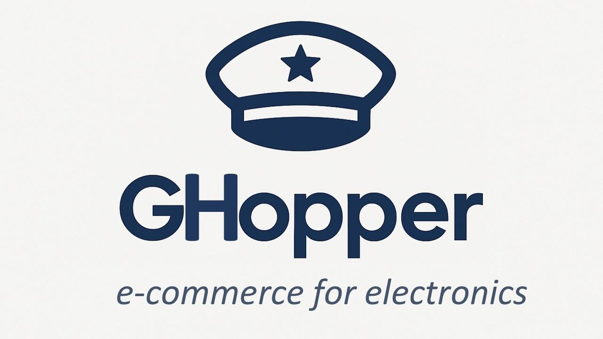

###  Company Background
Ghopper is an e-commerce company founded in 2018 by two Community College graduates.  The company began as an online site selling returned, slightly-used electronic components and equipment, mostly to hobbyists.  GHopper remains an e-commerce company selling a wider range of popular electronics and has expanded globally.  It is a data-forward company that continues to improve customer satisfaction by tracking customer metrics such as refund rates, loyalty program response and fulfillment times.  

###  As a Data Analyst for GHopper I am responsible for:   
- Answering stakeholder questions through analysis of customer data.
- Identifying gaps and limitations in the datasets provided.
- Sharing insights and observations developed from close engagement with the data.

### Stakeholder's Questions Addressed:
  I investigated the following 4 key business questions using GHopper's customer data for 2019 to 2022. (links to [raw Excel customer data] & [ERD](elist_excel_erd))  
  1. [What were the overall trends in sales during this time?](#what-were-the-overall-trends-in-sales-for-2019-to-2022)
  2. [What were our monthly and yearly growth rates?](#what-were-the-monthly-and-yearly-growth-rates)
  3. [How is the new loyalty program performing?  Should we keep using it?](#how-is-the-new-loyalty-program-performing-should-we-keep-using-it)
  4. [What were our refund rates and average order value (AOV)?](#what-were-our-refund-rates-and-average-order-value-aov)  

 ### First Steps - clean the data
 Before addressing the Stakeholder's questions, I cleaned the Excel data and created a worksheet listing the data gaps [cleaned Excel customer data].  
 The process consists of the following steps:
   - In Excel, I preserved the raw column data, I copied the data to in separate columns, identified as "_cleaned", I filtered the data and removed blank enteries.    This included  by removing  
    

    
### 1. What were the overall trends in sales for 2019 to 2022?

### 2. What were the monthly and yearly growth rates?

### 3. How is the new loyalty program performing? Should we keep using it? 

### 4. What were our refund rates and average order value (AOV)?

 How is the loyalty program performing and should we keep using it?
Notes: To determin how the loyalty program is performing, I compared two metrics: a) the USD prices and b) number of purchases for each group. 
1. Before analysis I removed entries where USD price is listed as $0. (Qty: 158 entries out of 108095 total)
2. And I removed entries where USD price is blank (Qty: 27 entries out of 108095)
3. Number of Loyalty entries = 45686, number of Non-loyalty entries = 62276. Both groups have same order of magnitude entries. 

