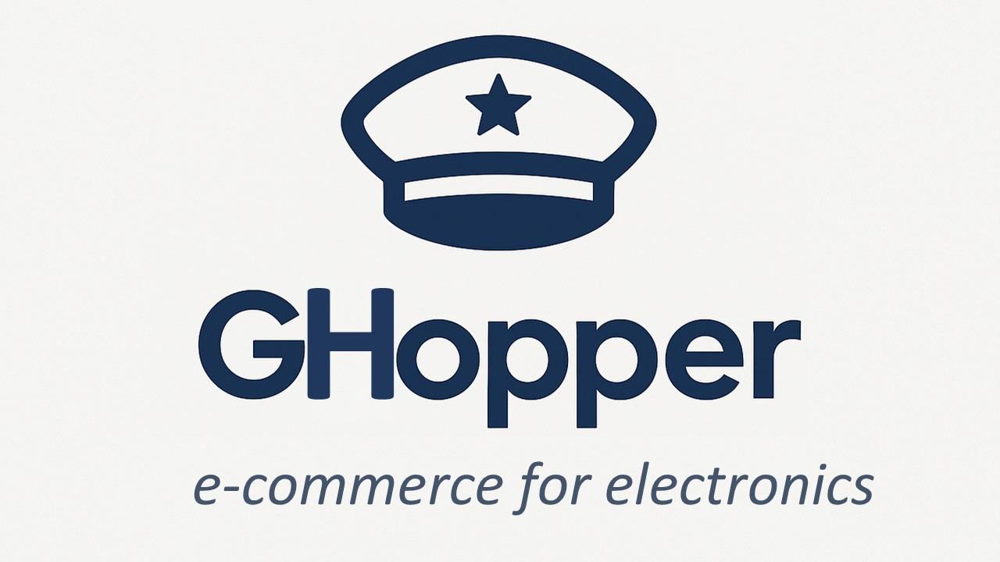
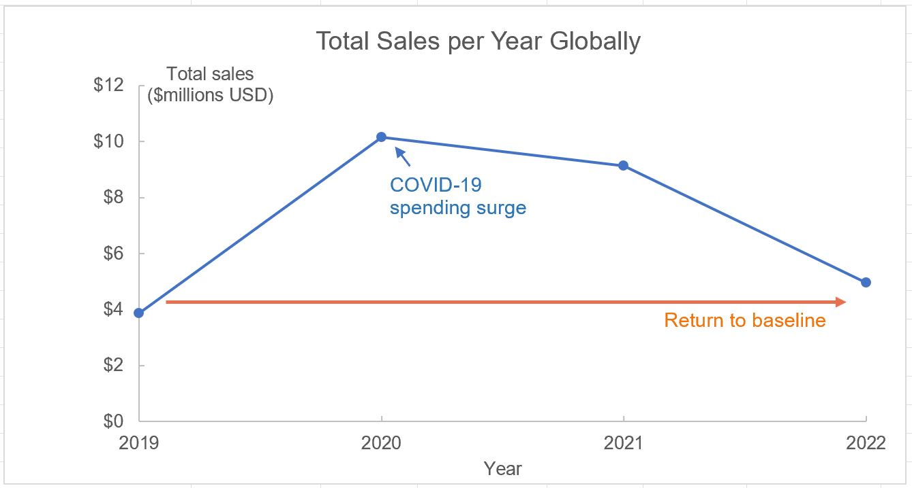
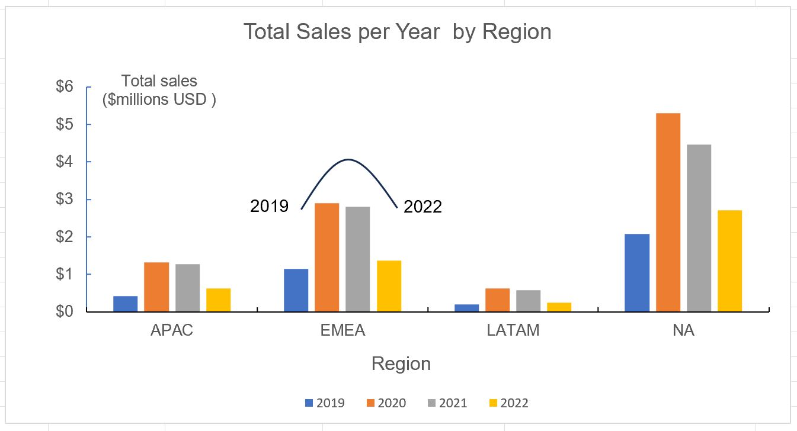
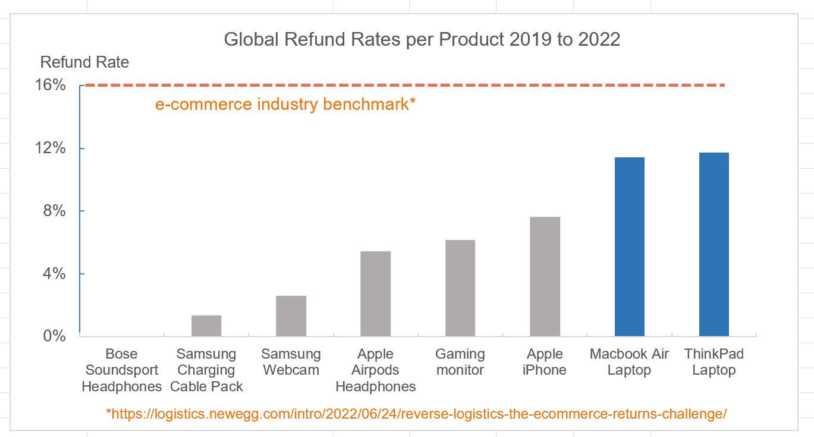
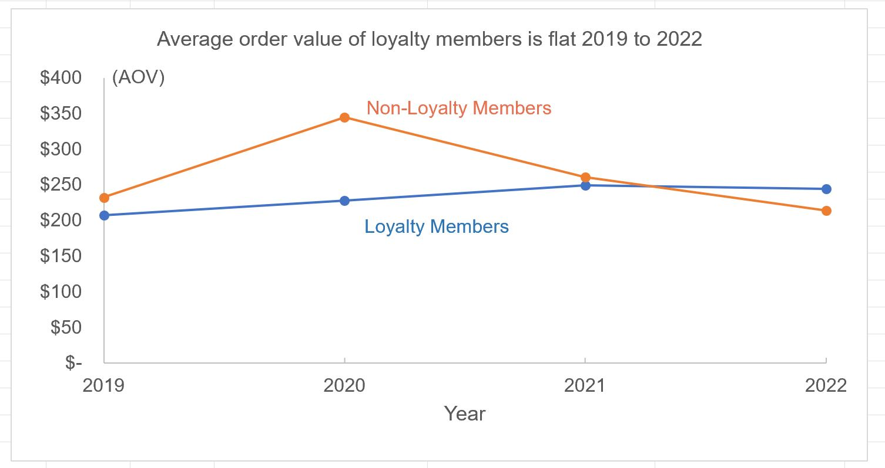

###  Executive Summary
GHopper is a U.S.-based e-commerce company with a global customer base that sells a wide range of consumer electronics. An analysis of customer data from 2019 to 2022 shows a performance peak in 2020, most likely driven by COVID-related spending, followed by a steady return to pre-pandemic revenue levels.

Regional sales indicate that North America remains the strongest market, generating nearly twice the revenue of EMEA countries. Refund-rate analysis reveals that laptops had the highest return rate, while the loyalty program showed limited influence on increasing average order value (AOV).

###  This analysis aims to address the following:   
- Answer stakeholder questions through analysis of customer data.
- Identify gaps and limitations in the datasets provided.
- Share insights and observations of customer spending and behavior. 

### Stakeholder's Questions Addressed:
  Three key business metrics are investigated using GHopper's customer data from 2019 to 2022. ([Excel customer data](data/Elist_Data_clean_GitHub.xlsx) & [ERD](images/eList_Excel_ERD.png))  
  1. [Overall trends in sales for 2019 to 2022](#1-overall-trends-in-sales-for-2019-to-2022)
  2. [Refund rates for 2019 to 2022](#2-refund-rates-for-2019-to-2022)
  3. [Performance of the new loyalty program against average order value (AOV)](#3-performance-of-the-new-loyalty-program-against-average-order-value-aov)
     
### 1. Overall trends in sales for 2019 to 2022
Below is a plot of total sales per year globally. 

- From 2019 to 2020 total sales increased by 163%. Note that 2020 was during the depths of the COVID pandemic  and the plot appears to reflect consumer spending during the stay-at-home directive. 
- This was followed by a drop in sales from 2021 to 2022 back to a baseline value of ~$4 million total sales. 
- Excluding pandemic-driven anomalies in 2020 and 2021, spending from 2019 to 2022 appears flat.
- Depending on the performance of 2023 sales, there may be a need to reinvigorate sales, perhaps through  stronger incentives programs, new product offerings, and a more impactful online presence. 

The following plot shows similar regional sales trends.   

- All regions show sales peaks at years 2020 and 2021.
- North America consistently dominated, generating nearly twice the sales of the next largest region, EMEA. 

### 2. Refund rates for 2019 to 2022
The plot below shows global refund rates per product line.

- For the years 2019 to 2022, the refund rates for all products remained below the industry benchmark for e-commerce sales.
- Laptops accounted for the highest percentage of refunds, with the Macbook Air and ThinkPad showing  almost identical refund rates.
- This suggests a potential need for a deeper investigation into the laptop category.
- Key questions to explore: were returns driven by performance dissatisfaction or by product defects? 
- If performance-related, offering alternative laptop models may reduce refund rates.
- If defect-related, production may want to strengthen their quality control checks prior to shipment.    

### 3. Performance of the new loyalty program against average order value (AOV)
The plot below shows the AOV aggregated into loyalty and non-loyalty customers.  

- On average, loyalty customers' purchasing behavior showed little change, with order sizes remaining flat from 2019 through 2022.
- Non-loyalty customers show a brief uptick in 2020 but then reverted back to pre-COVID levels.
- This pattern aligns with the overall sales trend: excluding pandemic years (2020 - 2021), purchasing behavior has remained stable.
- Recommendation: extend the loyalty program for another year to collect additional data and confirm whether purchasing behavior remains steady.  

 
