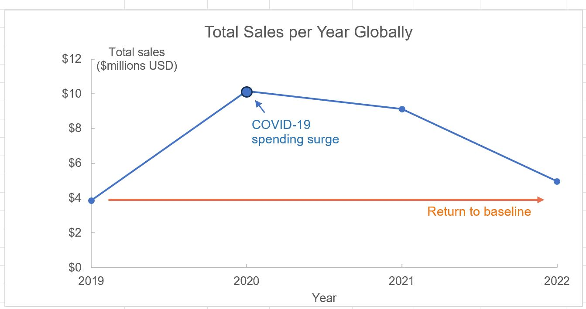

###  Company Background
GHopper is an e-commerce company founded in 2018 by two Community College graduates.  The company began as an online site selling returned, slightly-used electronic components and equipment, mostly to hobbyists.  GHopper remains an e-commerce company selling a wider range of popular electronics and has expanded globally.  It is a data-forward company that continues to improve customer satisfaction by tracking customer metrics such as refund rates, loyalty program response and fulfillment times.  

###  As a Data Analyst for GHopper I am responsible for:   
- Answering stakeholder questions through analysis of customer data.
- Identifying gaps and limitations in the datasets provided.
- Sharing insights and observations developed from close engagement with the data.

### Stakeholder's Questions Addressed:
  I investigated the following 3 key business questions using GHopper's customer data for 2019 to 2022. (links to [Excel customer data] & [ERD](images/eList_Excel_ERD.png)  
  1. [What were the overall trends in sales for 2019 to 2022?](#1-what-were-the-overall-trends-in-sales-for-2019-to-2022)
  2. [What were our refund rates?](#2-what-were-our-refund-rates)
  3. [How is the new loyalty program performing against average order value (AOV)? Should we keep using the program?](#3-how-is-the-new-loyalty-program-performing-against-average-order-value-aov-should-we-keep-using-the-program)
     

    

    
### 1. What were the overall trends in sales for 2019 to 2022?  
Below is a plot of total sales per year globally (left). From 2019 to 2020 total sales increased by 163%. This was followed by a drop in sales from 2021 to 2022 back to back to basline values of $4 million total sales. Note that 2020 was during the depth of COVID and 2020 appears to reflect consumer spending during the lock-down.

Excluding pandemic-driven anomalies in 2020 and 2021, spending from 2019 to 2022 appears flat. This points to a need to reinvigorate sales, perhaps through  stronger incentives programs, new product offerings, and a more impactful online presence to boost sales. 

The plot on the right shows regional sales trends, which followed a similar pattern.  North America consistently dominated, generating nearly twice the sales of the next largest region, EMEA. 

### 2. What were our refund rates?
 

### 3. How is the new loyalty program performing against average order value (AOV)? Should we keep using the program?
The loyalty program and AOV are customer behavior metrics. 

How is the loyalty program performing and should we keep using it?
Notes: To determin how the loyalty program is performing, I compared two metrics: a) the USD prices and b) number of purchases for each group. 
1. Before analysis I removed entries where USD price is listed as $0. (Qty: 158 entries out of 108095 total)
2. And I removed entries where USD price is blank (Qty: 27 entries out of 108095)
3. Number of Loyalty entries = 45686, number of Non-loyalty entries = 62276. Both groups have same order of magnitude entries.

 ### First Steps - clean the data
 Before addressing the Stakeholder's questions, I cleaned the Excel data and created a worksheet listing the data gaps [cleaned Excel customer data].  
 The process consists of the following steps:
   - In Excel, I preserved the raw column data, I copied the data to in separate columns, identified as "_cleaned", I filtered the data and removed blank enteries.    This included  by removing  

